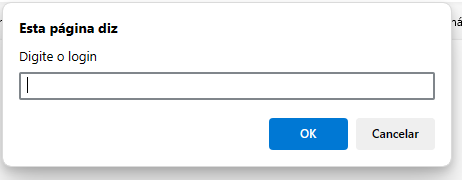

# ativLoginSenhaWhile
atividade de javascript com login e senha usando while.
  

  <h3>Abre a página e o prompt já pede usuário e senha.</h3>
  

  

  <h3>Todas as mensagens de erro.</h3>
  

  

  <h3>Se conseguir, acesso permitido, se não, dá um document write e fala acesso negado.</h3>
  

